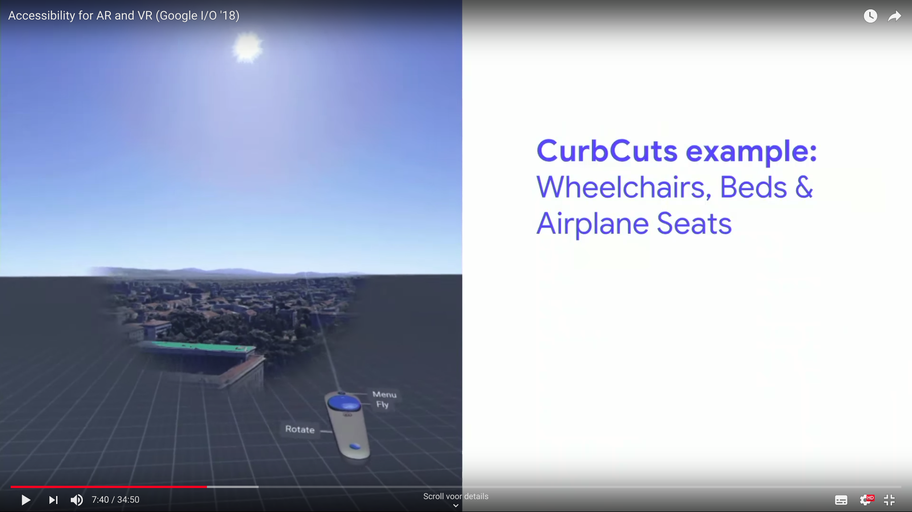

# A11y WebVR

This repository is a place for me to test different concepts for accessibility in webVR.

## Ideas

A mixture of all ideas. Small or Big.

- Video with `.vtt` subtitles.
- Video with sign language option?
- "Sticky" cursor (for smaller buttons or people with motor impairment).
- For people that have a hard time turning around. (Turning the world around you instead of you.)
- Screenreader and keyboard, hide HTML elements behind the scene and connect these to the buttons and objects inside VR.
- Sound option for mono and stereo (For example when deaf on one ear or one broken earbud).
- Option for a standing or sitting experience.
- Move "cursor" with touch pad for when user can't use arm to point.
- Good focus indicator. Even for when looking outside the "correct" view.
- Translate keyboard events (Tab or Enter) to controller events.

## Testing

... Coming soon?

### Some statistics

[People with a disablility in the **USA** (12.8%)](https://data.census.gov/cedsci/results/all?q=Disability&t=Disability&tab=ACSDT5Y2017.B18101&ps=app*from@RESULTS_ALL$app*page@1$search*suggestions@false$banner*show@false$table*currentPage@1)
[People with a disability in the **Netherlands**](https://opendata.cbs.nl/statline/#/CBS/nl/dataset/83005NED/table?ts=1549894612717)

### Images

Source: [Accessibility for AR and VR (Google I/O '18)](https://www.youtube.com/watch?v=pW2oWy-ePS8)
[Back up](#ideas)

### Resources

[Daydream Labs: Accessibility in VR](https://www.blog.google/products/daydream/daydream-labs-accessibility-vr/)
[People with a disablility in the **USA** (12.8%)](https://data.census.gov/cedsci/results/all?q=Disability&t=Disability&tab=ACSDT5Y2017.B18101&ps=app*from@RESULTS_ALL$app*page@1$search*suggestions@false$banner*show@false$table*currentPage@1)
[People with a disability in the **Netherlands**](https://opendata.cbs.nl/statline/#/CBS/nl/dataset/83005NED/table?ts=1549894612717)
[Accessibility for AR and VR (Google I/O '18)](https://www.youtube.com/watch?v=pW2oWy-ePS8)
[Accessibility in VR for the visually impaired](https://www.digitalbodies.net/virtual-reality/accessibility-in-vr-for-the-visually-impaired/)
[THOUGHTS ON ACCESSIBILITY ISSUES WITH VR](https://ablegamers.org/thoughts-on-accessibility-and-vr/)
[Accessibility of Virtual Reality Environments](https://unimelb.edu.au/accessibility/guides/vr-old)